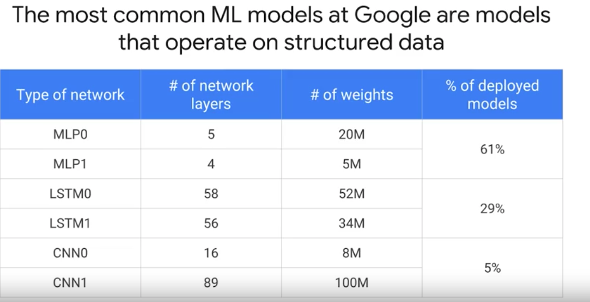

# Course 1. End to End Machine Learning with Tensorflow on GCP

## Effective ML
> effective ML을 구축하기 위해 필요한 세 가지: Big data(분산처리 ML 플랫폼), feature engineering, 그리고 적합한 model architecture
- Don't sample data, don't aggregate data, use it as much as you can
- `parameter server`: When things are `not` embarasingly parallel such as gradient decent
> batching is really important 배치로 나눠서 train, 분산 처리도 되어야 하고, embarasingly parallel하지 않은 문제는 parameter 서버도 필요. Map reduce와 같이 단순하지 않은 문제들. shared memory에 각 epoch 단계에서 update 되어야 함
- Scale Up vs Scale Out
> Scale up 은 언젠가는 한계에 봉착하게 되고 결국은 후회. Scale out is the answer.
- TF Estimator : deeplearning에 쓸 수 있지만 boosted regression tree에도 사용 가능

## Fully managed ML
- `managed service` for training and deploying Tensorflow models
- Hyper parameter tuning: number of node, stride size, number of bucket
- API 서빙: autoscale prediction code
### Toy project vs managed service
> toy project와 상용 ML 서비스의 아키텍처를 비교해보자
- toy project

- managed service

## Explore the dataset
- The most common ML models at Google are models that operate on structured data
> 가장 많이 사용하는 network 모델은 LSTM도 CNN도 아닌 4~5 layer 정도를 구성된 MLP(Multilayer perceptron)임! 

## Lab: Exploring natality dataset
- 목적: 출생 전 아기의 몸무게를 예측해서 (regression problem) `스페셜 케어`가 필요한 아기를 조기 발견해서 아기의 사망율을 낮추는 것
> 간호사가 사용할 ML 어플리케이션에 ML 예측 모델을 적용하여 서비스 한다면 아래와 같은 그림일 것이다  

> 원본: https://github.com/GoogleCloudPlatform/training-data-analyst/blob/master/courses/machine_learning/deepdive/06_structured/labs/1_explore.ipynb
~~~python
from google.cloud import bigquery
df = bigquery.Client().query(query).to_dataframe()

df.head()
# logy 비교 
df.plot(x='is_male', y='num_babies', kind='bar')
df.plot(x='is_male', y='num_babies', logy=True, kind='bar')
~~~
> JDBC, ODBC 이런 것 아니고 그냥 python package에 통합해놨음. pandas dataframe으로도 변환 가능하고 시각화 하기에 다른 package를 import할 필요가 없음. 뭔가 되게 간단함  
- get distinct value
~~~python
def get_distinct_values(column_name):
  sql = """
  SELECT {0},
    count(1) as num_babies,
    avg(weight_pounds) as avg_wt
  FROM
    publicdata.samples.natality
  WHERE
    year > 2000
  GROUP BY
    {0}
  """.format(column_name)
  
  result = bigquery.Client().query(sql).to_dataframe()

  result.head()
  df.plot(x="is_male", y="num_babies", kind='bar')
  df.plot(x="is_male", y="avg_wt", kind='bar')

  return result

get_distinct_values("is_male")
~~~
> 관련이 있을 것 같은 컬럼은 모델에 그냥 넣고 사용하지 말고 모두 시각화 해서 봐야 함

## Discussion
- 공공 데이터 활용해야 할 사람의 입장에서 raw 데이터가 어떻게 유용한 형태로 바뀌는지 생각해보자
- 데이터 분석의 의도와 목적을 파악해 보자
- Log scale은 어떨 때 사용하고 어떨 때 사용하면 안되나?
- bigquery를 import하면 내부적으로 panda를 사용하기 때문에 dataframe을 가지고 plot을 그릴 수 있음
- 메모리에 다 올리지 못하는 데이터는 TF가 복잡한 부분들을 처리해 준다고 하는데 이 `복잡한 부분`이 무엇일까?
- bagging과 boosting에 deep neural network을 사용하면 어떤 것이 장점이 되나?
- pandas를 써서 데이터 전처리 후 TF로 보낼 수는 있지만 분산 처리가 안됨. 분산처리를 하려면 data flow(=apache beam)를 사용
- LSTM, CNN이 유명하지만 실제로 구글에서 많이 사용하는 모델은 의외로 적은 수의 layer를 사용하는 MLP임. LSTM은 text analysis에 CNN은 image analysis(또는 text classfication)에 활용하는 unstructured data에 적용 가능한 모델인 반면 MLP는 structured data에 적용하기 때문에 모델 배포 수가 많은 것은 다시 한번 생각해보자
- data lab을 생성할 때 vm을 선택할 수 있고 생성된 vm은 사용이 끝나면 삭제 가능
- Tip! jupyter notebook에서 reference 보기 : `shift + tab`

